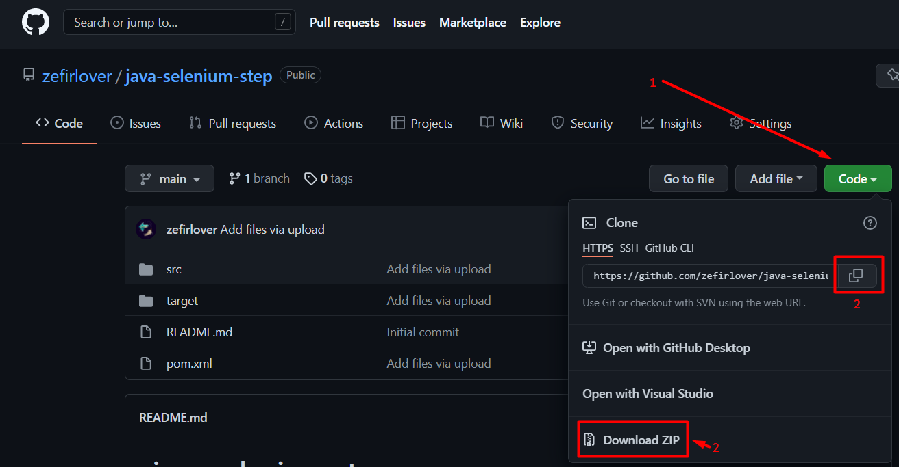

# java-selenium-step
Java Maven Selenium JUnit automation tests created to test authorisation 
and appearance of the tabs in the "step" application.
#### What is the "step" application?
"step" is a unified platform for software automation that allows you to make 
the most out of automation artifacts while getting rid of specific tools.
More information you can get here: https://step.exense.ch/knowledgebase/3.18/
### Project installation
First, you need to install the actual Java Development Kit (18 or above) from here:
https://www.oracle.com/java/technologies/downloads/#java18. Be aware about the environmental
variables.

Second, go to the https://step.exense.ch/knowledgebase/3.18/getting-started/quick-setup/
page and do the actions mentioned there.

Then, install the Chrome and the appropriate version of ChromeDriver:
https://chromedriver.chromium.org/downloads

Do not forget about installing the Maven: https://www.baeldung.com/install-maven-on-windows-linux-mac

After that you can download the project.
Click the "code" button. You can download ZIP archive or use the `git clone` command.

Also, go to the `src/test/resources/conf.properties` and change the
`C:/bin/chromedriver.exe`
reference to the path where your `chromedriver.exe` is placed, or on the 
environmental variable.

### How to start your tests
To start the tests you can use the ▶ button on your IDE or the `mvn test` command.